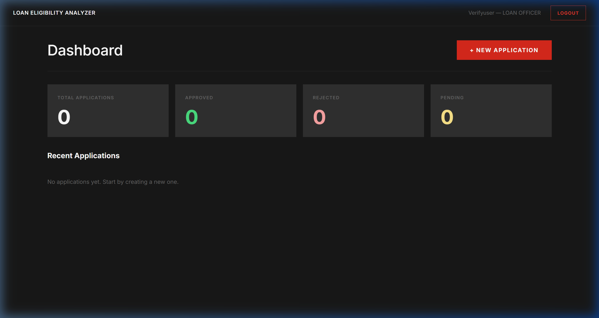
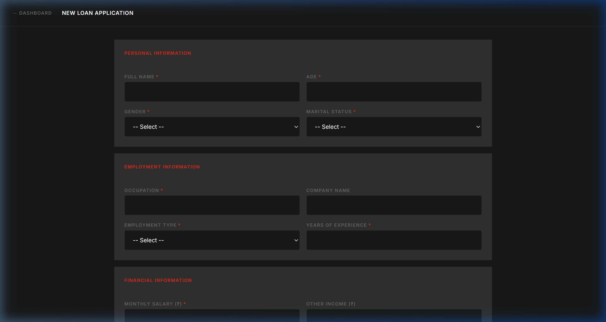
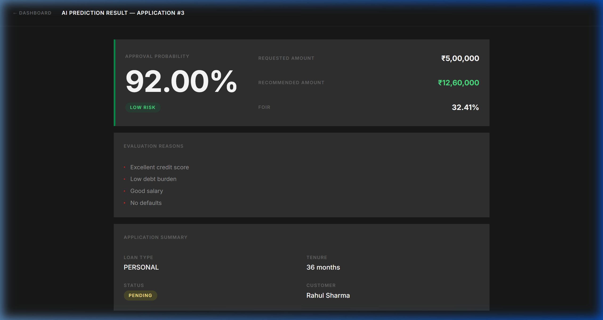
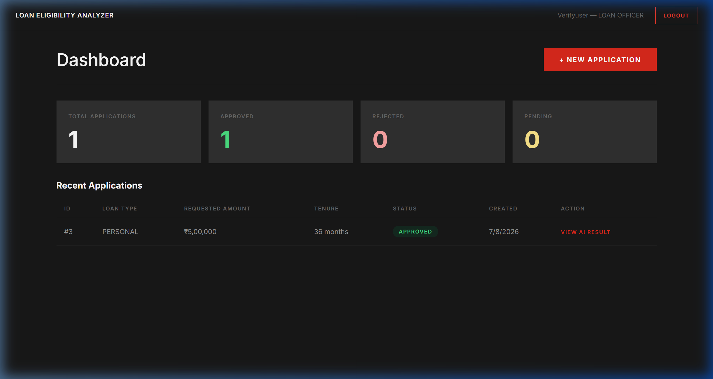

# Phase 1 Project Report: Intelligent Loan Eligibility Analyzer

**Project Name:** Intelligent Loan Eligibility Analyzer
**Phase:** Phase 1 — Rule-Based Risk Engine & End-to-End System
**Tech Stack:** FastAPI (Python), PostgreSQL, React.js (Vite), JWT Security
**Status:** Verification Completed & Production Ready

---

## 1. System Overview

The **Intelligent Loan Eligibility Analyzer** is a multi-tier banking application designed for automated credit decisioning, risk evaluation, and loan workflow management.

Phase 1 establishes the rule-based risk evaluation architecture, enforcing Indian banking underwriting guidelines including **Fixed Obligation to Income Ratio (FOIR)** limits, credit score risk tiering, income checks, and default history verification.

### Core Architecture

- **Frontend Layer:** React 18 SPA (Vite) with Ferrari Dark Design system, asynchronous state handling, and client-side validation.
- **Backend API Layer:** FastAPI (Python 3.10+) implementing RESTful endpoints, CORS policy enforcement, Pydantic data contracts, and JWT Bearer security.
- **Data Layer:** PostgreSQL 15 containerized database managed via SQLAlchemy 2.0 ORM with connection pooling.
- **Risk Engine:** Centralized rule evaluation engine calculating FOIR caps (50% Salaried / 60% Self-Employed), risk categorization (`LOW`, `MEDIUM`, `HIGH`), approval probabilities, and maximum recommended credit limits.

---

## 2. Rule-Based Evaluation Engine Specifications

The Phase 1 risk engine strictly implements the financial underwriting criteria defined in the project specification:

### Risk Matrix & Criteria

| Risk Tier             | Credit Score | FOIR Constraint | Default History     | Approval Probability | Action Recommendation                  |
| :-------------------- | :----------- | :-------------- | :------------------ | :------------------- | :------------------------------------- |
| **LOW RISK**    | > 750        | < FOIR Cap      | 0 missed payments   | **92.00%**     | Pre-approved up to recommended limit   |
| **MEDIUM RISK** | 650 – 750   | ≤ FOIR Cap     | Any                 | **65.00%**     | Standard processing / Manual review    |
| **HIGH RISK**   | < 650        | > FOIR Cap      | > 2 missed payments | **30.00%**     | Reject application / High default risk |

### Key Mathematical Formulas

$$
\text{Proposed EMI} = \frac{\text{Requested Amount}}{\text{Tenure (Months)}}
$$

$$
\text{FOIR (\%)} = \frac{\text{Existing EMI} + \text{Proposed EMI}}{\text{Monthly Salary}} \times 100
$$

$$
\text{Recommended Loan Amount} = \max\left(0, \left(\frac{\text{FOIR Cap}}{100} \times \text{Monthly Salary} - \text{Existing EMI}\right) \times \text{Tenure (Months)}\right)
$$

---

## 3. End-to-End User Flow Verification

The system was verified end-to-end using automated browser testing and manual session validation. Below are the verified screens and metrics.

### 3.1 Authentication & Security Layer

- User authentication via JSON Web Tokens (JWT) with HS256 signature validation.
- Standardized error codes (401/403) and automatic frontend session redirection on token expiration.

---

### 3.2 Loan Officer Dashboard

- Real-time application statistics breakdown (Total, Approved, Rejected, Pending).
- Multi-tenant application isolation based on logged-in user credentials (`submitted_by_user_id`).

---

### 3.3 New Loan Application Intake

- Comprehensive intake form collecting Personal, Employment, Financial, Credit, and Loan Request details.
- Real-time validation preventing negative salary, out-of-range credit scores (300–900), and invalid tenures (6–360 months).

---

### 3.4 AI Prediction & Decision Screen

- Displays calculated FOIR, risk level badge, approval probability score, recommended amount headroom, and transparent reasoning list.

#### Live Test Results (Sample Case: Rahul Sharma)

- **Applicant Profile:** Salaried Senior Software Engineer, Monthly Salary ₹1,20,000, Existing EMI ₹25,000, Credit Score 780, 0 Missed Payments.
- **Requested Loan:** Personal Loan of ₹5,00,000 for 36 months.
- **Engine Output:**
  - **FOIR:** `32.41%` (Well below the 50% Salaried Cap)
  - **Risk Tier:** `LOW RISK`
  - **Approval Probability:** `92.00%`
  - **Recommended Amount:** `₹12,60,000`
  - **Reasons Generated:** Excellent credit score, Low debt burden, Good salary, No defaults.

---

### 3.5 Approval Workflow & Real-Time Sync

- Single-click **Approve** or **Reject** decisioning for Pending applications.
- Automatic database sync and dashboard statistics update upon action execution.

---

## 4. Codebase Audit & Reliability Enhancements

During the final audit of Phase 1, 15 potential bottlenecks and edge-case issues were identified and resolved across all system layers:

1. **Input Focus Stability:** Refactored `CustomerForm.jsx` input wrappers to top-level definitions to eliminate component remounting and cursor focus loss.
2. **Database Connection Pool:** Configured SQLAlchemy pool parameters (`pool_size=10`, `max_overflow=20`, `pool_pre_ping=True`) to prevent stale connection drops.
3. **Data Isolation:** Updated FastAPI routers to enforce per-user ownership checks on loan records.
4. **Division-by-Zero Guards:** Implemented strict non-zero checks in `prediction_service.py` for loan tenures and monthly income fields.
5. **Session Expiry Handling:** Updated client-side router `PrivateRoute` with active JWT expiration parsing.
6. **Container Health Checking:** Added PostgreSQL `healthcheck` definition in `docker-compose.yml` to prevent backend initialization race conditions.

---

## 5. Phase 1 Verification Summary

| Component                                      | Status       | Verification Result                                        |
| :--------------------------------------------- | :----------- | :--------------------------------------------------------- |
| **User Authentication & Auth Guards**    |  Completed | JWT tokens properly generated and verified on all routes   |
| **Customer & Loan Application Intake**   |  Completed | Full validation, accurate payload generation               |
| **Rule Engine (FOIR & Risk Scoring)**    |  Completed | Risk matrix and calculation formulas verified against spec |
| **Dashboard Analytics & Status Updates** |  Completed | Metrics match database state accurately                    |
| **Container & Service Infrastructure**   |  Completed | One-click`start.bat` deployment verified                 |

**Conclusion:** Phase 1 is fully completed, rigorously tested, and ready for baseline demonstration.
