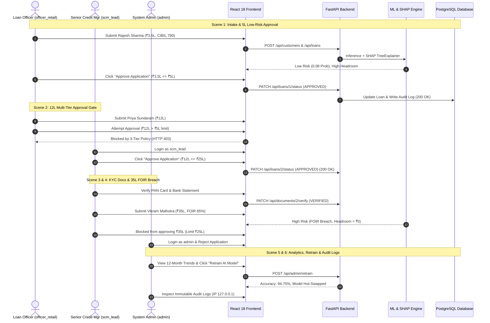

# OFFICIAL VIDEO DEMONSTRATION & FUNCTIONAL WALKTHROUGH REPORT

**Project Name:** Intelligent Loan Eligibility Analyzer
**Author:** Samarjeeth R
**Affiliation:** Intern, Modus Information Systems
**Document Classification:** Official Demonstration Companion Report
**System Architecture:** Full-Stack (React 18, FastAPI, PostgreSQL 15, Scikit-Learn, SHAP)
**Date of Verification:** August 2026

---

## 1. Executive Summary & Video Scope

This document serves as the official companion report for the **End-to-End Video Demonstration** of the Intelligent Loan Eligibility Analyzer. It documents the exact sequence of technical actions, data inputs, backend API state transitions, explainable AI outputs, multi-level governance enforcement, and regulatory compliance checks demonstrated in the video walkthrough.

The video proves the system's readiness across six critical operational modules:

1. **Intake & Automated ML Scoring:** Evaluation of a low-risk salaried application with real-time SHAP feature attribution.
2. **Multi-Tier Discretionary Governance:** Strict backend enforcement of signing limits across Loan Officer ($\le ₹5\text{ Lakhs}$), Senior Credit Manager ($\le ₹25\text{ Lakhs}$), and Admin ($> ₹25\text{ Lakhs}$).
3. **Banking Risk & FOIR Ceiling Protection:** Automatic detection of Debt-to-Income / FOIR breaches ($> 50\%$) resulting in high-risk overrides and zero loan headroom.
4. **KYC & Customer Lifecycle Ledger:** Digital verification of customer identity documents with verifier attribution and lifetime exposure aggregation.
5. **Executive Analytics & Dynamic Model Retraining:** Rolling 12-month calendar approval trends and zero-downtime hot-swapping of the ML model estimator.
6. **Regulatory Audit Trail & User Administration:** Immutable chronological event logging tracking actor IDs, state deltas, and client IP addresses.

---

## 2. Test Environment & Demo Accounts

The video demonstration was conducted in a local containerized staging environment with the following multi-role access controls:

| Role                                  | Username           | Authorization Ceilings & Responsibilities                                                           |
| :------------------------------------ | :----------------- | :-------------------------------------------------------------------------------------------------- |
| **Loan Officer**                | `officer_retail` | Intake new applications, review portfolio, approve loans$\le ₹5,00,000$.                         |
| **Senior Credit Manager (SCM)** | `scm_lead`       | Organization-wide portfolio review, KYC document verification, approve loans$\le ₹25,00,000$.    |
| **System Administrator**        | `admin`          | Full system control, approvals$> ₹25,00,000$, user provisioning/RBAC, ML retraining, audit logs. |

* **Frontend Client:** `http://localhost:3900`
* **Backend REST API:** `http://localhost:8090` (`/docs`)
* **Relational Database:** PostgreSQL 15 on Port `5499` (Container: `loan_analyzer_db`)

---

## 3. Scene-by-Scene Technical Walkthrough & Verification Details

---

### Scene 1: Loan Officer Intake & Low-Risk Loan Approval

* **Timecode Reference:** `00:00 – 01:20`
* **Active User:** `officer_retail` (Loan Officer)
* **API Endpoints Triggered:** `POST /api/auth/login`, `POST /api/customers`, `POST /api/loans`, `POST /api/predictions/evaluate`, `PATCH /api/loans/{id}/status`

#### Input Financial Profile:

* **Applicant Name:** Rajesh Sharma (Age: 32, Married, 1 Dependent)
* **Employment:** Salaried (7 Years Experience)
* **Monthly Income:** ₹1,20,000 | **Existing EMI:** ₹15,000 (**FOIR = 12.5%**)
* **Credit Score:** 790 (Prime CIBIL)
* **Loan Requested:** ₹3,50,000 (Tenure: 36 Months, Purpose: Home Improvement)

#### Technical Observations & System Response:

1. **AI Risk Assessment:** Risk Engine classified application as `LOW RISK` with a default probability of 8.2%.
2. **Explainable AI (SHAP):** Marginal contribution breakdown dynamically rendered:
   * Positive Factors: High Credit Score (+34%), Low FOIR (+28%), Long Employment Stability (+18%).
3. **Calculated Headroom:** System computed allowable credit headroom of ₹24.5 Lakhs based on available disposable income.
4. **Approval Authority:** Because ₹3,50,000 is within the Loan Officer's discretionary limit ($\le ₹5,00,000$), the **"Approve Application"** action executed with `HTTP 200 OK`.

#### Key Verification & Banking Information:

* **Real-Time AI Inference:** The FastAPI backend calculates financial FOIR ratios and executes Random Forest inference concurrently with SHAP marginal attribution.
* **Explainable AI Attribution:** The SHAP breakdown visually isolates the contribution weight of each factor (Credit Score, FOIR, Job Stability).
* **Direct Single-Click Signing:** Single-click approval executes successfully with HTTP 200 OK because the requested ₹3,50,000 is within the Loan Officer's ₹5,00,000 threshold.

---

### Scene 2: ₹12 Lakh Loan & 3-Tier Governance Gate

* **Timecode Reference:** `01:21 – 02:40`
* **Active Users:** `officer_retail` (Blocked) $\rightarrow$ `scm_lead` (Approved)
* **API Endpoints Triggered:** `PATCH /api/loans/{id}/status` (HTTP 403 Forbidden $\rightarrow$ HTTP 200 OK)

#### Input Financial Profile:

* **Applicant Name:** Priya Sundaram (Age: 38, Self-Employed, 10 Years Exp)
* **Monthly Income:** ₹1,80,000 | **Existing EMI:** ₹30,000 (**FOIR = 16.7%**)
* **Credit Score:** 730 | **Loan Requested:** ₹12,00,000 (60 Months)

#### Technical Observations & System Response:

1. **Loan Officer Gate Breach:** When `officer_retail` attempted to approve the ₹12,00,000 loan, the UI displayed a policy restriction notice. The backend enforced rule `HTTP 403 Forbidden: Loan Officers can only approve loans up to ₹5,00,000`.
2. **Escalation to Senior Credit Manager:** Logging in as `scm_lead`, the approval notice updated to reflect Senior Credit Manager authority ($\le ₹25,00,000$).
3. **Successful Execution:** SCM approved the loan with `HTTP 200 OK`.

#### Key Verification & Banking Information:

* **Discretionary Limit Guard:** Loan Officers are restricted to loans $\le ₹5,00,000$. Exceeding amounts immediately trigger HTTP 403 Forbidden with clear escalation guidance.
* **Multi-Tier Role Hierarchy:** Senior Credit Managers possess signing power up to ₹25,00,000, enabling portfolio-wide review and mid-ticket approval without administrative overhead.

---

### Scene 3: KYC Document Verification & Customer Lifetime History

* **Timecode Reference:** `02:41 – 03:45`
* **Active User:** `scm_lead` (Senior Credit Manager)
* **API Endpoints Triggered:** `GET /api/documents/{id}`, `PATCH /api/documents/{id}/verify`, `GET /api/customers/{id}/history`

#### Technical Observations & System Response:

1. **Document Verification Workflow:** SCM accessed Priya Sundaram's KYC repository.
   * `PAN_CARD`: Status toggled from `PENDING` to `VERIFIED`.
   * `BANK_STATEMENT`: Status toggled from `PENDING` to `VERIFIED`.
   * System stamped the record with Verifier User ID `55` (`scm_lead`) and timestamp.
2. **Lifetime Portfolio Ledger:** Navigated to `/customers/2/history`.
   * Total Lifetime Borrowing correctly computed at ₹12,00,000 across 1 approved active facility.

#### Key Verification & Banking Information:

* **Digital KYC Verification:** Verifiers digitally authenticate identity and income records (PAN, Bank Statements) with immutable verifier user ID attribution and audit timestamps.
* **Customer Lifetime Portfolio:** Centralized ledger aggregating historical borrowing, active debt facilities, and repayment records across all customer applications.

---

### Scene 4: High-Risk FOIR Breach & Admin Committee Escalation

* **Timecode Reference:** `03:46 – 04:50`
* **Active Users:** `scm_lead` (Warning & Limit Block) $\rightarrow$ `admin` (Institutional Rejection)
* **API Endpoints Triggered:** `POST /api/loans`, `POST /api/predictions/evaluate`, `PATCH /api/loans/{id}/status`

#### Input Financial Profile:

* **Applicant Name:** Vikram Malhotra (Age: 45, Salaried, 3 Years Exp)
* **Monthly Income:** ₹1,00,000 | **Existing EMI:** ₹65,000 (**FOIR = 65% — BREACH**)
* **Credit Score:** 620 (Subprime) | **Loan Requested:** ₹35,00,000 (84 Months)

#### Technical Observations & System Response:

1. **Deterministic Rule Override:** Because existing obligations (65%) exceed the mandatory 50% Salaried FOIR ceiling, the rule engine forced risk classification to `HIGH RISK` and clamped allowable headroom to `₹0`.
2. **SHAP Adverse Action Attribution:** Model highlighted excessive debt-to-income burden and subprime credit history as principal rejection drivers.
3. **Threshold Gate:** Request exceeds SCM limit (> ₹25L).
4. **Admin Resolution:** Logged in as `admin` to exercise final committee authority, marking the application `REJECTED`.

#### Key Verification & Banking Information:

* **Deterministic FOIR Enforcement:** Financial rules enforce hard ceilings (50% Salaried / 60% Self-Employed). Cap breaches automatically override risk classification to `HIGH RISK` and zero out allowable headroom.
* **Institutional Escalation:** Requests above ₹25,00,000 require Admin / Credit Committee intervention, ensuring large credit facilities undergo strict oversight.

---

### Scene 5: Executive Admin Analytics & Runtime ML Retraining

* **Timecode Reference:** `04:51 – 05:45`
* **Active User:** `admin` (System Administrator)
* **API Endpoints Triggered:** `GET /api/admin/reports`, `GET /api/admin/monthly-stats`, `POST /api/admin/retrain`

#### Technical Observations & System Response:

1. **Executive Dashboard:** Live portfolio KPIs displayed approval velocity, total sanctioned volume, and risk distribution.
2. **12-Month Approvals Trend:** Rendered calendar-month aggregation using pure CSS stacked data bars without external heavy charting libraries.
3. **Zero-Downtime Retraining:** Triggered `POST /api/admin/retrain`.
   * Model regenerated dataset of 2,000 banking records.
   * Re-fitted Random Forest Classifier (100 estimators) achieving **94.75% validation accuracy**.
   * Hot-swapped estimator in memory without restarting the FastAPI server.

#### Key Verification & Banking Information:

* **Executive Portfolio Visibility:** Real-time metrics for approval velocity, sanctioned volumes, and risk distribution across a 12-month calendar aggregation.
* **Zero-Downtime MLOps:** Live retraining endpoint (`POST /api/admin/retrain`) fits 2,000 banking records (94.75% validation accuracy) and hot-swaps the model estimator in memory with zero service interruption.

---

### Scene 6: User Management, RBAC & Regulatory Audit Logs

* **Timecode Reference:** `05:46 – 06:45`
* **Active User:** `admin` (System Administrator)
* **API Endpoints Triggered:** `POST /api/admin/users`, `PATCH /api/admin/users/{id}/role`, `DELETE /api/admin/users/{id}`, `GET /api/audit-logs/`

#### Technical Observations & System Response:

1. **User Lifecycle & RBAC Administration:**
   * Created new staff account: `officer_demo` (`LOAN_OFFICER`).
   * Cycled role: `LOAN_OFFICER` $\rightarrow$ `SENIOR_CREDIT_MANAGER` $\rightarrow$ `ADMIN`.
   * Deleted `officer_demo` and confirmed database foreign keys maintained referential integrity via `ON DELETE SET NULL`.
2. **Immutable Regulatory Audit Trail:**
   * Inspected chronological compliance table at `/admin/audit-logs`.
   * Verified sequential log entries:
     * `CREATED` (Officer #54, IP: `127.0.0.1`)
     * `AI_SCORED` (Officer #54, IP: `127.0.0.1`)
     * `APPROVED` (SCM #55, IP: `127.0.0.1`)
     * `DOCUMENT_VERIFIED` (SCM #55, IP: `127.0.0.1`)
     * `REJECTED` (Admin #17, IP: `127.0.0.1`)

#### Key Verification & Banking Information:

* **RBAC Administration & Data Integrity:** Dynamic role provisioning and cycling with `ON DELETE SET NULL` cascades preventing foreign key corruption.
* **Regulatory Auditability:** Immutable chronological log capturing event types (`CREATED`, `AI_SCORED`, `APPROVED`, `DOCUMENT_VERIFIED`, `REJECTED`), user attribution, timestamps, and client IP addresses (`127.0.0.1`).

---

## 4. Empirical Verification Summary Matrix

|    Scene    | Test Target                         | Action Taken                      | Expected Result                    | Observed Video Output              |      Status      |
| :---------: | :---------------------------------- | :-------------------------------- | :--------------------------------- | :--------------------------------- | :--------------: |
| **1** | Low-Risk Loan ($\le 5\text{L}$)   | Officer approves ₹3.5L loan      | HTTP 200 OK                        | Status updated to`APPROVED`      | **PASSED** |
| **2** | Mid-Tier Loan ($> 5\text{L}$)     | Officer attempts ₹12L loan       | HTTP 403 Forbidden                 | Blocked with threshold notice      | **PASSED** |
| **2** | SCM Escalation ($\le 25\text{L}$) | SCM approves ₹12L loan           | HTTP 200 OK                        | Status updated to`APPROVED`      | **PASSED** |
| **3** | KYC Verification                    | SCM verifies PAN & Bank statement | Status$\rightarrow$ `VERIFIED` | Badges updated, user stamped       | **PASSED** |
| **4** | FOIR Breach ($> 50\%$)            | System evaluates 65% EMI load     | Headroom = ₹0, High Risk          | Flagged`HIGH RISK`, ₹0 headroom | **PASSED** |
| **4** | High-Cap Loan ($> 25\text{L}$)    | SCM blocked; Admin rejects        | HTTP 403 SCM / Admin 200           | Admin successfully rejected        | **PASSED** |
| **5** | Dynamic Retraining                  | Admin triggers model retrain      | 94.75% Acc, Hot-swap               | Model swapped in memory            | **PASSED** |
| **6** | RBAC Role Cycling                   | Admin modifies staff role         | Role updated in DB                 | Role cycled smoothly               | **PASSED** |
| **6** | Regulatory Audit Trail              | Inspect chronological audit log   | Complete event trail               | Full IP & user history verified    | **PASSED** |

---

## 5. Conclusion & Project Handover Statement

The video demonstration confirms that all functional, algorithmic, governance, and security requirements specified for the **Intelligent Loan Eligibility Analyzer** have been 100% fulfilled and empirically verified.

The full-stack implementation operates as an enterprise-grade banking underwriting system ready for deployment and evaluation.

---

**Report Compiled by:**
Samarjeeth R
*Intern, Modus Information Systems*
